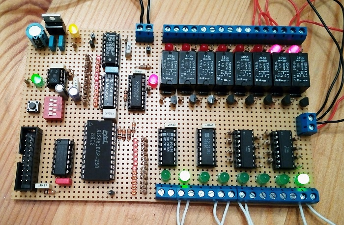

Many years ago I came across an article on an electronics magazine that presented a little circuit based on the Motorola MC14500 1-bit ICU. The circuit was very simple and allowed to control the ICU manually through a set of dip-switches and buttons. I never bothered to build it, though I got fascinated by the simplicity of the ICU and the 1-bit idea. The simple circuit though didn't convince me as it didn't sound much fun to give the instructions one by one everytime you wanted to execute a program. Reading more about the MC14500 I started to think it would have been cool to make a simple PLC based on it. Since then I never really got around doing it but the schematic somehow came clear in my head, yes I do see things sometimes. Till this weekend I finally set down to actually wire wrap it.

The board is now fully functionaly, I am just short of one 4099 (the output latch) and I will need to wait Monday to get that. I have no schematic at the moment, not even a pen drawn one, sorry I have this habit of building things out of the top of my head somethings. I will get a schematics done at some point. The circuit is quite simple anyway. The clock is generated by a 555 (at 1Hz at the momment to keep the LEDs blinking show more interesting). It feeds an 8 bit counter working as the program counter. The PC value goes into a 2K EEPROM (the higher 3 bits come from dip-switches so I can have up to 8 programs). Data bus from the EEPROM feeds the ICU instruction (4 bits) and input/ouput address (3 bits). There is then the 4099 to latch the 8 output values that in turn controls the 8 relays. On the input side are optocuplers followed by a 4051 (8xMUX) to select the inputs. Couple of other logic chips are just glue logic.

For more blinken lights effect all data and address lines as well as inputs and outputs have an LED connected to them. After I get the 4099 I will try to come up with some "practical" application. I could consider also the idea to leave it clocked at 1Hz or slightly faster for the coolness factor.

EEPROM programming happens through the 20 pins header where all data and address lines, along with write enable and programming signals are available. 
