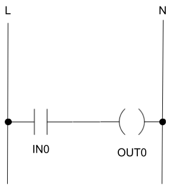

# PLC14500 Programmmers Guide

In this guide I will assume you are familiar with Ladder Logic diagram symbols. If these are new to you I suggest you
first familiarize with the symbology. One good starting point is this
Wikipedia [article](https://en.wikipedia.org/wiki/Ladder_logic).

I will also assume you have assembled and tested the board following the instructions in the [READ.me](../README.md) file.

## Reading Inputs and controlling outputs

In this first example we will be simply reading the status of one of the inputs and mirroring it to an output. A ladder
diagram for such application would look something like this:



This can be translated to MC14500 assembly (with some extra code, we will get to that in a moment).

````
.board=PLC14500-Nano

IEN IN6
OEN IN6

LD  IN0
STO OUT0

JMP 0
````

The `.board` directive is metadata that serves the purpose to tell the assembler on which type of board we want to run
our code. This will have an effect on the generated bytecode as well as will provide relevant errors should some part
of the program make use of features not available in a certain board type.

The next two instructions `IEN` and `OEN` are the two intruders that don't appear in our ladder diagram. These instructions
stand for `Input ENable` and `Output ENable`. They are a powerful construct that allows to build conditionals that, in
practice, surf over (skip) a block of code. But, for the time being, let's not digress into this. At this stage it's
enough to know that, after reset, the MC14500 "disables" its input and output or, in other words, ignores any actual
value read from the inputs and any write operation to the outputs. This is a bit unfortunate as it means we must have
such instructions in every program or the program would do nothing at all. For simplicity, we tell the MC14500 to 
enable input/output operations on the status of input IN6, so we will need to make sure this is flipped to ON.

The next to lines are the actual representation of our ladder diagram. The `LD` instruction will load the value of IN0
into the only register `RR`. After this, `STO` will store the value in `RR` into `OUT0` so, in practice, OUT0 will 
reflect the status of `IN0`.

The last instruction `JMP 0`, jumps at the start of the program. **Note!** The PLC14500-Nano doesn't have a presettable
Program Counter, for this reason it allow jumping only to 0. The assembler will error if you try to do otherwise. 
However, worry not, with the `IEN`/`OEN` instructions and the `SKZ` conditional there are plenty of options to have more
complex flows than just a single loop.

Let's go ahead and assemble the program. I'm assuming here you downloaded the release zip and unziped it on a folder 
`C:\plc14500`, adjust your paths if needed:

````
asm14500.exe examples\example1.asm
````

If you now look into the `examples` folder you should have a 256-bytes file named `example1.bin`. The file is 256 bytes 
because that's what the bootloader of a PLC14500-Nano expects, your program is just 5 bytes long, the rest has been padded
with `0x0F`. You can see this with a binary editor:

````
Offset(h) 00 01 02 03 04 05 06 07 08 09 0A 0B 0C 0D 0E 0F
00000000  EA EB 81 88 0C 0F 0F 0F 0F 0F 0F 0F 0F 0F 0F 0F  êë.ˆ............
000000E0  0F 0F 0F 0F 0F 0F 0F 0F 0F 0F 0F 0F 0F 0F 0F 0F  ................
.....
000000F0  0F 0F 0F 0F 0F 0F 0F 0F 0F 0F 0F 0F 0F 0F 0F 0F  ................
````

Before we can test the program on the board we will need to identify which COM port gets assigned to our board. Also,
ensured you followed the board assembly instructions and burned the bootloader into the Arduino Nano. The easiest way
to find out the right COM port is to open the Arduino IDE, open the `Tools\Port` menu and take a note of what ports
are available (possibly none), then plug in the PLC14500-Nano and check again `Tools\Port` to determine the new one
that appeared. In this guide I will assume `COM3`, adjust examples as needed.

Let's now load the assembled program to the board:

````
flash14500.cmd examples\example1.bin COM3
````

You should see the `ADDR` and `DATA` LEDs on the board flashing for a few seconds, wait the command to complete and then 
press the `RST` button on the board to ensure it's running. Also make sure the two switches on top are set to `HI` and
`RUN` respectively. This ensures the clock is running at normal speed.

To test the program make sure `IN6` is switched to on (remember, this reflects the input/output enable of the MC14500),
if you now press momentarily the `IN0` button you will notice the `OUT0` LED will follow.

Go ahead and turn off `IN6`, now regardless of the state of `IN0` the `OUT0` will not change. 

